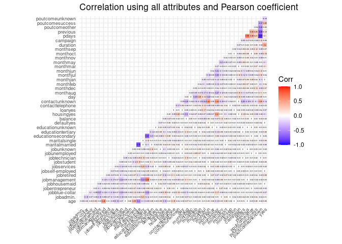
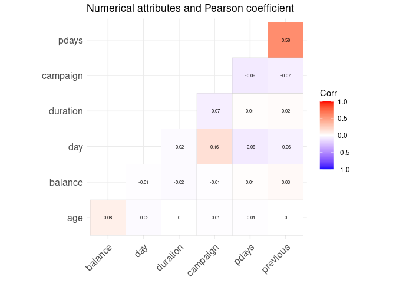
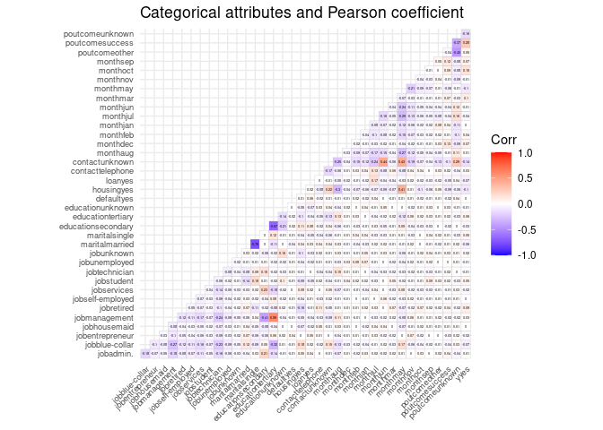
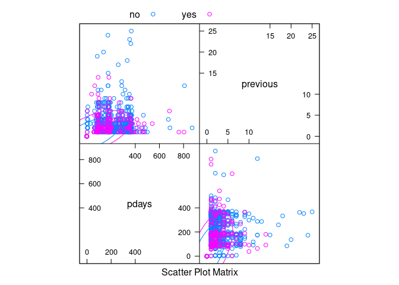

Data science technical review answers
================
Isai Angulo Jimenez
2022-06-07

This is the document I created trying to cover the most of the questions
knowing my own limitations and acquired knowledge

## 1.- Dataset used

For the current process I searched for a dataset called “Bank Marketing
Data Set”, the data is related to phone calls and the classification
goal is to predict if a client subscribe to a term deposit. I find this
interesting due to the real life implications this kind of problem
involves such as decision making, productivity increase or customer
targets. The link for obtaining the dataset is the following:
<https://archive.ics.uci.edu/ml/machine-learning-databases/00222/bank.zip>.
The dataset consists of 17 attributes, 10 categorical (factors) and 7
noncategorical (numerical) and within the factors, a class attribute or
the output variable meaning if a client susbcribed or not a term
deposit. It contains 41,188 instances in the full csv, and is also
included a csv containing just 4,119 instances, representing the 10% of
the total.

## 2.- Correlation plot

In order to explore the data, this kind of plots allow me to understand
how the variables interact between them. For this dataset containing a
mixture of attribute types, I chose to show a general correlation plot
containing all 17 variables, and one per categorical and noncategorical
data. Two packages are needed for model.matrix() function.

``` r
bank <- read.csv(file = "bank.csv", header = TRUE, sep = ";", stringsAsFactors = TRUE)

library(ggcorrplot)
```

    ## Loading required package: ggplot2

``` r
# install.packages("ggcorrplot", INSTALL_opts = '--no-lock')
library(dplyr)
```

    ## 
    ## Attaching package: 'dplyr'

    ## The following objects are masked from 'package:stats':
    ## 
    ##     filter, lag

    ## The following objects are masked from 'package:base':
    ## 
    ##     intersect, setdiff, setequal, union

``` r
# install.packages("dplyr", INSTALL_opts = '--no-lock')

(mod.mat <- model.matrix(~0+., data=bank) %>% 
  cor() %>% 
  ggcorrplot(show.diag = F, type="lower", lab=TRUE, lab_size=1, tl.cex = 7,
             title = "Correlation using all attributes and Pearson coefficient"))
```

<!-- -->

``` r
num_cols <- unlist(lapply(bank, is.numeric)) # Identify numeric columns
bank_num <- bank[ ,num_cols] # Subset numeric columns of data
(mod.mat.num <- model.matrix(~0+., data=bank_num) %>% 
  cor() %>% 
  ggcorrplot(show.diag = F, type="lower", lab=TRUE, lab_size=2,
             title = "Numerical attributes and Pearson coefficient"))
```

<!-- -->

``` r
chr_cols <- unlist(lapply(bank, is.factor)) # Identify nonnumeric columns
bank_chr <- bank[ ,chr_cols] # Subset nonnumeric columns of data

(mod.mat.chr <- model.matrix(~0+., data=bank_chr) %>% 
  cor() %>% 
  ggcorrplot(show.diag = F, type="lower", lab=TRUE, lab_size=1, tl.cex = 7,
             title = "Categorical attributes and Pearson coefficient"))
```

<!-- -->

Some key observations can be made among the level of education and some
kind of jobs, especifaclly the tertiary education and management. Also
certain months seem to have an increased number of communication whether
a client has a housing loan or not, such as May and having a housing
loan, representing the last month of communication. Finally, success in
previous marketing campaigns seems strongly related to a very probable
subscription to a term deposit. These arise from the categorical
attributes.

For numerical ones, the most notable correlation seems to be with number
of previous contacts and the number of days that passed by after a
client was last contacted about any previous campaign.

## 3.- Visualization about most interesting info

Taking the last observation made, a scatterplot with ellipses is shown,
the ellipses representing the mean of the observations of the number of
previous contacts and number of days that passed, respectively, compared
against the final outcome of subscribing to a term deposit. Here it
might be seen the importance of establishing good communication channels
and keep doing it continuosly with clients in order to achieve a
positive answer.

``` r
library(caret)
```

    ## Loading required package: lattice

    ## Warning in system("timedatectl", intern = TRUE): running command 'timedatectl'
    ## had status 1

``` r
# install.packages("caret", INSTALL_opts = '--no-lock')
featurePlot(x = bank[, 14:15], 
            y = bank$y, 
            plot = "ellipse",
            ## Add a key at the top
            auto.key = list(columns = 3))
```

    ## Warning in draw.key(simpleKey(...), draw = FALSE): not enough rows for columns

<!-- -->

## 4.- Suitable ML algorithms

Since this dataset contains a class atribute, I could choose among the
supervised techniques and even use some subsetting approaches in order
to avoid some overfitting problems, but also important to note is the
class attribute which falls into qualitative data rather than
quantitative, being a binary outcome thus making it discrete, which
allows us to be more specific for which model to be used. This finally
comes to the category of a classification problem rather than a
regression one, so I might opt choosing methods such as
K-nearest-neighbors, boosting or logistic regression, the last one
despite its name being a classification one.

## 5.- Choosing a ML method

I would give a shot to the logistic regression method and use the 16
variables or predictors available and obtain a first ML model This will
allow to explore some valuable information from the predictors, such as
the p-value. I would look for the predictor or predictors with the
lowest p-value and create a second model with the most significant
predictors. But of course also giving a try with the predictors that
were given a major correlation value at the beginning such as job,
education, housing, month, pdays and previous.

## 6.- Life cycle flowchart of the proposed ML

<embed src="lc.html.pdf" width="800px" height="600px" type="application/pdf" />

A brief description of what I propose as a flowchart follows the next
steps:

-   Data preparation involving any handling of attribute type, inclusion
    of headers, separators, etc.
-   Model training with the specified parameters and possible tuning of
    them.
-   Model packaging ensuring all dependencies are functional and ready
    to be carried out.
-   Model assessment with new data ensuring metrics behavior is well
    represented from the training.
-   Model deployment where the model is served into production level and
    scheduled for real time execution or periodacally.
-   Model monitor involves tasks as ensuring the behavior of the model
    is still in accordance of the original model, if metrics are still
    satisfying the expected outcome, or even if certain data is needed
    or could be left out.

## 7.- Frameworks and libraries

A great variety of platforms such as frameworks like Tensorflow, Pytorch
and programming languages as R, Python, Java to even the cloud-based
solutions demand a specific problem definition. For the proposed dataset
and flowchart I feel capable working with R and even serving a basic
Tensorflow http rest.
